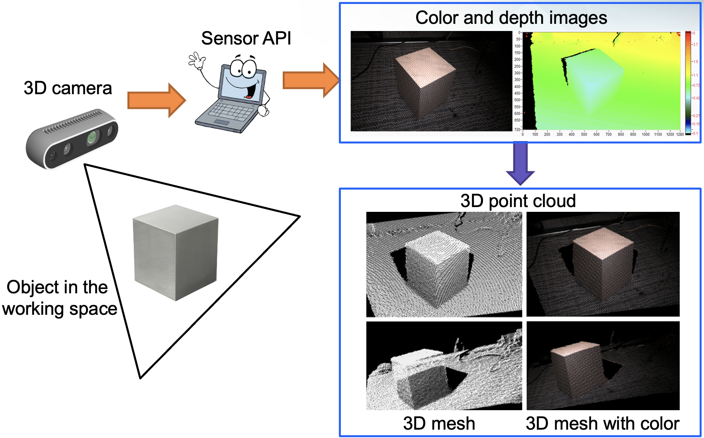
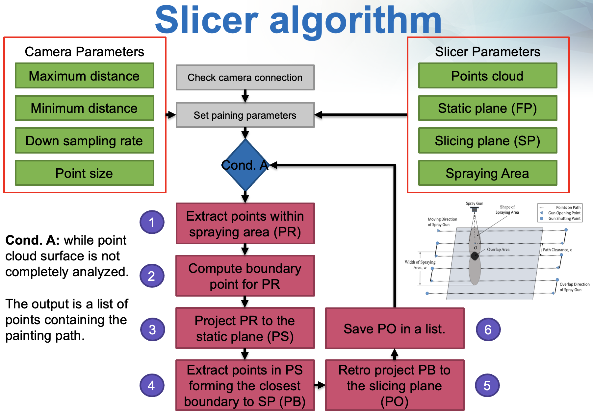
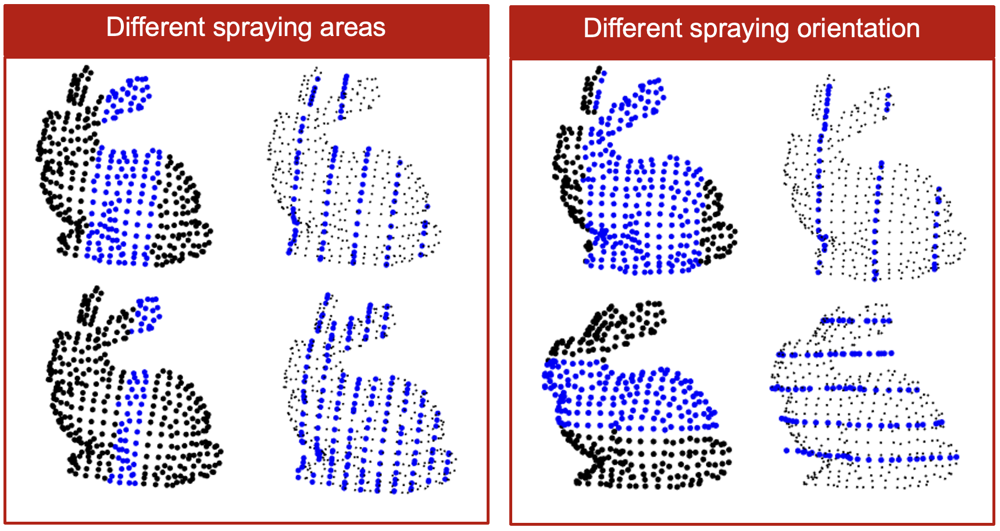

Automated path generation using point cloud data with MCCL-compatible motion output, reducing robot programming time.

<!--more-->

## 📌 Overview and Challenges

Industrial robotic automation often suffers from:

- ⏱️ **Long programming and commissioning time**  
- 👷 **High dependence on expert operators**
- 🔄 **Low adaptability to changes in geometry or task variation**

This project tackles these limitations by building an **automated pipeline** that generates optimal robot motion paths **directly from 3D point cloud data**, eliminating the need for manual teach-pendant programming.

➡️ The core objective was to **automate path planning**, **enable rapid program generation**, and ensure **compatibility with existing industrial motion control libraries (e.g. MCCL)**.

---

## 🧠 What the System Does

This system transforms raw 3D perception into executable robot programs through several automated stages:

### 🎯 Point Cloud–Based Path Generation

- Acquired dense 3D surface data using vision sensors from real workpieces
- Processed and segmented point cloud data to extract meaningful geometry
- Applied slicing-based algorithms to generate **continuous and task-specific paths**

### 🔌 Controller-Level Integration

- Exported generated paths into **MCCL-compatible motion programs**
- Enabled direct execution on industrial robotic arms without offline manual editing
- Eliminated traditional teach-pendant and post-processing steps

### 🤖 Motion Execution Support

- Provided low-level motion control and smooth trajectory execution
- Supported communication with operator HMI for operation and monitoring

This end-to-end pipeline turns vision input into real robot movement, enabling automation where manual programming was once required.

---

## 🛠️ Contributions

The project delivered several technical innovations spanning perception, planning, and industrial deployment:

- ✨ **Automatic Path Generation from Point Clouds**  
  Designed and implemented algorithms that convert 3D geometric data into continuous, optimized robotic motion paths.

- 🔗 **Industrial Controller Compatibility (MCCL)**  
  Ensured the generated paths are directly executable on MCCL-based motion control systems used in real industrial robots — no offline editing needed.

- 🤖 **Fully Automated Vision-to-Motion Pipeline**  
  Built a unified system that integrates perception, planning, and motion execution into a single deployable workflow.

---

# 📊 Results and Impact

This work produced measurable improvements and demonstrated real industrial value:

- 🧠 **True End-to-End Automation**  
  The full pipeline — from vision sensing to motion execution — runs automatically, removing manual steps.

- ⏱️ **Significant Reduction in Setup Time**  
  Tasks that previously took hours of expert programming are now generated in minutes.

- 🔄 **Enhanced Flexibility and Adaptability**  
  The system adapts to changes in workpiece geometry without the need for reprogramming — improving uptime and responsiveness.

- 🤝 **Industrial Deployment Ready**  
  With MCCL compatibility and robust motion control, the solution integrates cleanly into existing automation environments.

---

# 🔗 Links
